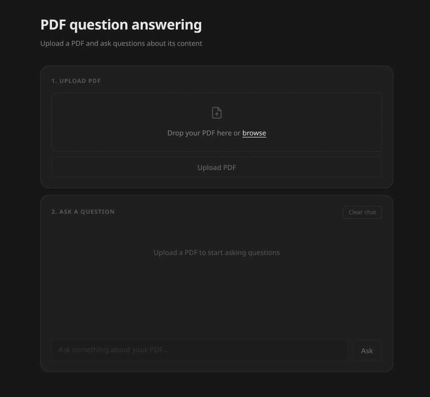

# Semantic RAG Search 


A production-ready RAG (Retrieval Augmented Generation) pipeline that lets you upload any PDF and ask questions about its content using semantic search and a large language model.

**Live Demo:** [huggingface.co/spaces/llhax/sementic-search-rag](https://huggingface.co/spaces/llhax/sementic-search-rag)

---

## What is this?

LLMs like GPT or LLaMA are powerful but they don't know about your private documents. Retraining a model on your data is expensive and slow. RAG solves this problem by retrieving relevant chunks from your documents at query time and passing them to the LLM as context, no retraining needed.

This project implements a full RAG pipeline from scratch:

- Upload any PDF
- The system chunks, embeds and indexes it
- Ask a question in natural language
- The system retrieves the most relevant chunks and generates an answer

---

## Architecture

```
PDF
 │
 ▼
load_pdf()          → Extract raw text from PDF
 │
 ▼
chunk_text()        → Split into sentence-aware chunks (500 chars, 2 sentence overlap)
 │
 ▼
embed_chunks()      → Convert chunks to 384-dim vectors (all-MiniLM-L6-v2)
 │
 ▼
build_index()       → Store vectors in FAISS IndexFlatL2
 │
 ▼
User questions		→ User's Question
 │
 ▼
find_similar()      → Embed question, retrieve top-k=3 chunks from FAISS
 │
 ▼
generate_answer()   → Pass context + question to Groq LLM → Return answer
```

---

## Tech Stack

| Component | Technology |
|---|---|
| Backend | FastAPI |
| Embeddings | sentence-transformers (all-MiniLM-L6-v2) |
| Vector Search | FAISS (IndexFlatL2) |
| LLM | Groq API (llama-3.3-70b-versatile) |
| Frontend | HTML / CSS / JavaScript |
| Deployment | Hugging Face Spaces (Docker) |

---

## Why Groq instead of a local model?

During development we first used **TinyLlama** running locally. It worked but had two problems:

- Inference on CPU was very slow (30-60 seconds per query)
- Small models don't follow prompt instructions reliably — our "say I don't know if answer isn't in context" instruction was often ignored

We then switched to the **Groq API** which runs LLaMA 3.3 70B on their hardware. The result:

- Response time dropped to under 2 seconds
- Much better instruction following
- Free tier is sufficient for a portfolio project

---

## Why not fine-tune our own model?

Fine-tuning and RAG serve different purposes:

- **Fine-tuning** teaches the model new behavior or style
- **RAG** gives the model access to specific documents at query time

For a document Q&A system RAG is the right tool. Fine-tuning would require retraining every time documents change — impractical and expensive. RAG handles new documents instantly by just re-indexing them.

---

## Chunking Strategy

Naive character-based chunking cuts sentences mid-way which destroys meaning and produces poor embeddings. This project uses sentence-aware chunking:

- Text is split at sentence boundaries (`.`, `!`, `?`)
- Chunks are built by accumulating sentences until 500 characters
- 2-sentence overlap between chunks ensures context is not lost at boundaries

---

## Evaluation

Tested on an Analysis of Algorithms PDF (75 pages, 23,901 characters).

Evaluation method: semantic similarity between RAG answers and expected answers using cosine similarity of sentence embeddings.

| Metric | Score |
|---|---|
| Average similarity score | 0.79 |
| Chunk size | 500 characters |
| Overlap | 2 sentences |
| Retrieval k | 3 |

---



---

## Run Locally

**1. Clone the repo**
```bash
git clone https://github.com/HmadAfzal/semantic-search-rag
cd semantic-search-rag
```

**2. Install dependencies**
```bash
pip install -r requirements.txt
```

**3. Set up environment variables**

Create a `.env` file:
```
GROQ_API_KEY=your_groq_api_key_here
```

**4. Run the API**
```bash
uvicorn main:app --reload
```

**5. Open the UI**

Open `index.html` in your browser or visit `http://localhost:8000`

---

## API Endpoints

**POST /upload**

Upload a PDF file.

```json
// Response
{
  "filename": "document.pdf",
  "message": "PDF uploaded successfully"
}
```

**POST /query**

Ask a question about the uploaded PDF.

```json
// Request
{
  "question": "How does merge sort work?"
}

// Response
{
  "answer": "Merge sort is a divide and conquer algorithm..."
}
```

---

## Project Structure

```
semantic-search-rag/
├── main.py          # FastAPI backend
├── rag.py           # RAG pipeline (load, chunk, embed, retrieve, generate)
├── index.html       # Frontend UI
├── Dockerfile       # Container configuration
├── requirements.txt # Python dependencies
└── .env             # API keys (not committed)
```

---

## Roadmap

This project was built by [Hmad Afzal](https://github.com/HmadAfzal/) as a personal portfolio project.
 Planned improvements:

- [ ] IndexIVFFlat for faster search on large document sets
- [ ] Multi-document support
- [ ] Dynamic k selection based on question type
- [ ] Evaluation dashboard

---

## External Resources

**Demo:** [huggingface.co/spaces/llhax/sementic-search-rag](https://huggingface.co/spaces/llhax/sementic-search-rag)<br>
**LinkedIn Post:** [View Post](https://www.linkedin.com/posts/hmad-afzal_i-built-a-full-rag-pipeline-for-question-share-7453763892867940352-ViNb?utm_source=share&utm_medium=member_desktop&rcm=ACoAAEdOn90Bny24D7Zh9y99ozKwcNNRSVapdws)<br>
**Email:** hmadafzal00@gmail.com<br>
**Instagram:** [@llha.x](https://www.instagram.com/llha.x)